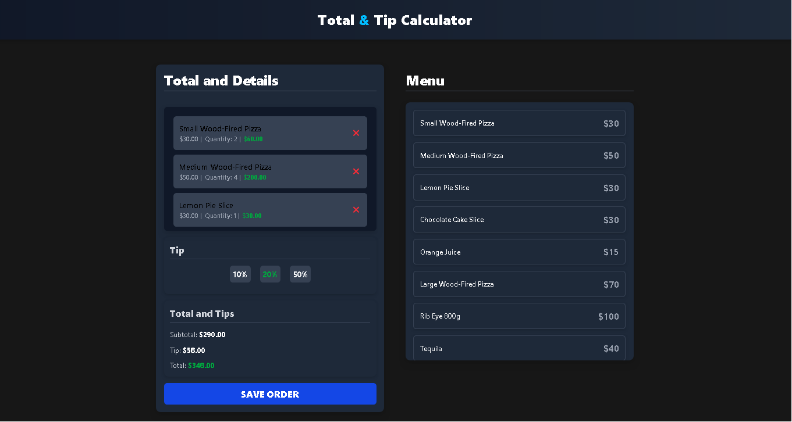

---

# Tip&Total Calculator - React & TypeScript & Tailwind Project 💰  

Tip Calculator is a small React-based project built with TypeScript. It allows users to calculate the total bill including tips, dynamically updating the UI based on user input. The project showcases state management, hooks, and TypeScript usage in a React application.  


### Demo Video  
[Online Preview](https://tiptotalcalculator.netlify.app/)  

---

## Features ✨  

- **Dynamic Tip Calculation**:  
  - Users can enter a bill amount.  
  - Select a tip percentage from predefined options.  
  - See the total amount, including the tip, update in real-time.  

- **State Management**:  
  - React hooks (`useState`, `useMemo`) are used for efficient state handling.  
  - Custom hook `useOrder.ts` manages the order logic.  

- **TypeScript for Type Safety**  
  - All components and data structures are typed for better code reliability.  

- **Component-Based Architecture**  
  - Modular React components for flexibility and maintainability.  

---

## Getting Started 🚀  

### Prerequisites  
Make sure you have the following installed:  
- Node.js  
- npm or yarn  

### Installation  
1. Clone the repository:  
   ```bash
   git clone https://github.com/Diego3128/tip-total-calculator
   ```  
2. Navigate to the project directory:  
   ```bash
   cd tip-calculator
   ```  
3. Install dependencies:  
   ```bash
   npm install
   ```  
4. Start the development server:  
   ```bash
   npm run dev
   ```  
5. Open your browser and navigate to:  
   ```
   http://localhost:5173/
   ```  

---

## Project Structure 🗂️  
```
TIP_CALCULATOR/
├── public/                # Static assets
├── src/                   # Source code
│   ├── components/        # React components
│   │   ├── MenuItem.tsx             # Renders individual menu items
│   │   ├── OrderContent.tsx         # Displays order summary
│   │   ├── OrderTotal.tsx           # Calculates and displays the order total
│   │   ├── TipPercentageForm.tsx    # Input form for selecting tip percentage
│   ├── data/              # Data files
│   │   ├── db.ts                  # Database examples
│   │   ├── tipOptions.ts          # Predefined tip percentage options
│   ├── helpers/           # Utility functions
│   │   ├── index.ts
│   ├── hooks/             # Custom hooks
│   │   ├── useOrder.ts           # Custom hook for order logic
│   ├── types/             # TypeScript type definitions
│   │   ├── index.ts
│   ├── App.tsx                # Main application component
│   ├── index.css              # Global styles
│   ├── main.tsx               # Main entry point
│   ├── vite-env.d.ts          # Vite environment types
├── .gitignore             
├── eslint.config.js       # ESLint configuration
├── index.html             # HTML entry point
├── README.md              # Project documentation
├── recording.mp4          # Demo video of the project
├── screenshot.png         # Project screenshot
├── tsconfig.json          # TypeScript configuration
└── vite.config.ts         # Vite configuration
```  

---

## Technologies Used 🛠️  
- React  
- TypeScript  
- React Hooks (useState, useMemo)  
- Tailwind for styling  
- Vite for fast development  

---

## Screenshots & Demo 🖼️  
### Project Screenshot  
  

### Demo Video  
[Watch the demo](./recording.mp4)  

---

## License 📜  
This project is open-source and free to use.  

---
